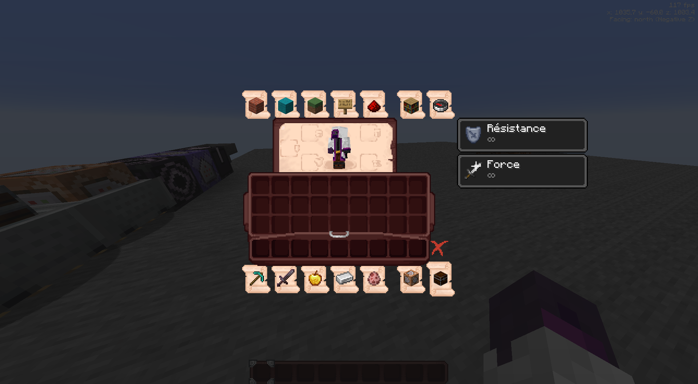
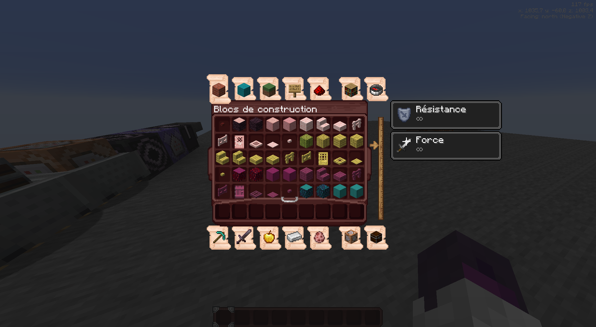
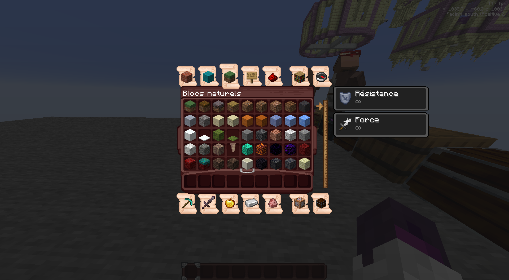
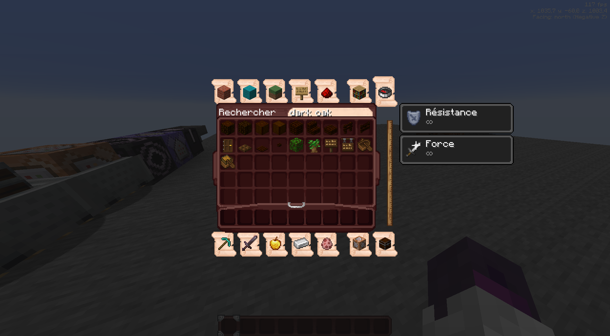
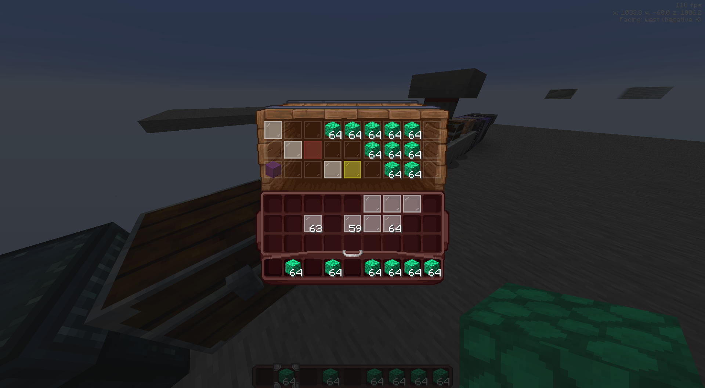
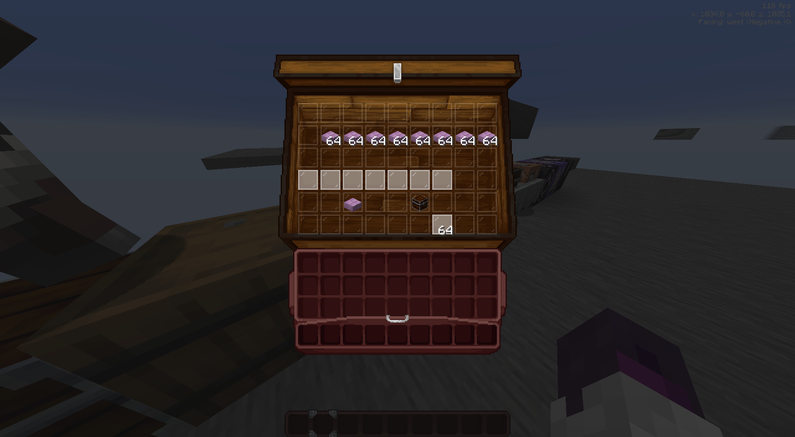
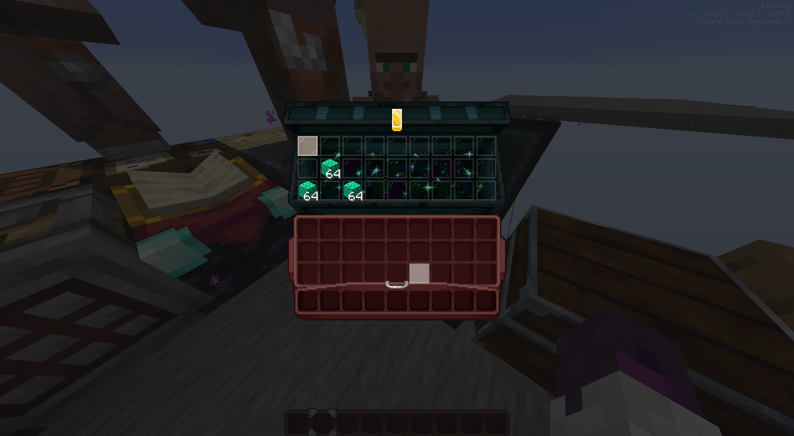
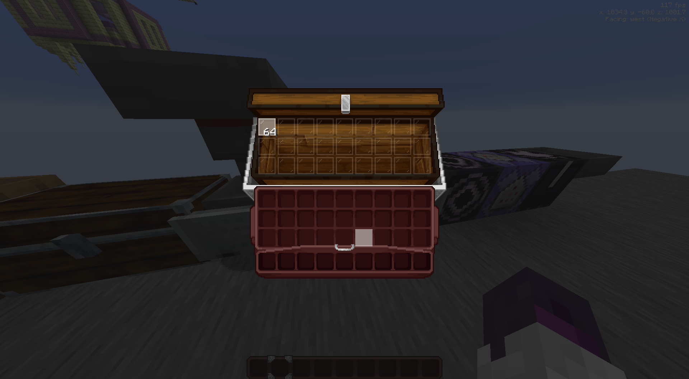
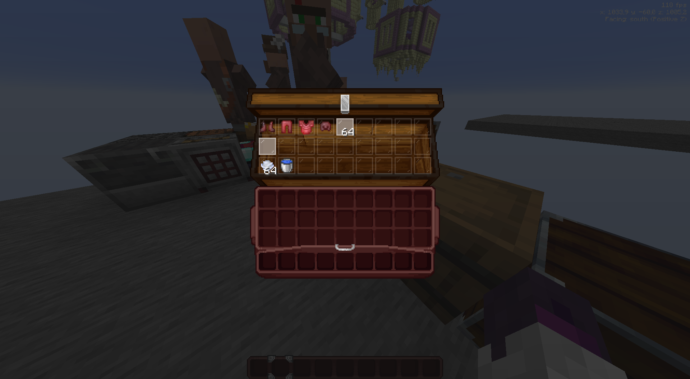

# Disclaimer
**N'étant pas un pixel artist accomplie, je me base principalement sur l'existant fait par [Shrimpsnail](https://github.com/Shrimpsnail/Immersive-Interfaces)**

# Todo
- [ ] Faire un meilleur script pour générer les fichiers de langue.
- [ ] Faire le cadre des effets de potions (style parchemin)
- [x] Faire cuire des oeufs.

# Créatif

## Inventaire Créatif

## Onglets

## Recherche

# Container

## Adding some help to see slots (optionnal)

